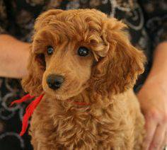
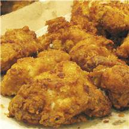
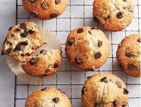
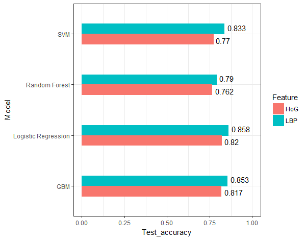

# Project: Dogs, Fried Chicken or Blueberry Muffins?




### [Full Project Description](doc/project3_desc.md)

Term: Fall 2017

+ Team #4
+ Team members
	+ team member 1  Shuyao Hao
	+ team member 2  Fan Gong
	+ team member 3  Hongjie Ren
	+ team member 4  Chenyun Wu
	+ team member 5  Yingbin Jiang

+ Project summary: In this project, we want to identify which category the picture belongs to: Dogs, Fried Chicken or Blueberry Muffins. The process consists of two parts: feature extraction and model training. 
For the feature extraction part, we adopted SIFT, HOG, LBP totally three methods to extract features from 3000 images. 
For the model training part, we adopted Logistics, Random Foreest and Support Vector Machine, Gradient Boosting Machine and Neural Network totally five methods to train classification models. 
After several attempts, We found that LBP+Logistic has the highest classification performance and the shortest running time.

Here is the test accuracy of our models:




The comparison of running time:

{align="left"}
	
**Contribution statement**: ([default](doc/a_note_on_contributions.md)) All team members contributed equally in all stages of this project. All team members approve our work presented in this GitHub repository including this contributions statement. 

Following [suggestions](http://nicercode.github.io/blog/2013-04-05-projects/) by [RICH FITZJOHN](http://nicercode.github.io/about/#Team) (@richfitz). This folder is orgarnized as follows.

```
proj/
├── lib/
├── data/
├── doc/
├── figs/
└── output/
```

Please see each subfolder for a README file.
